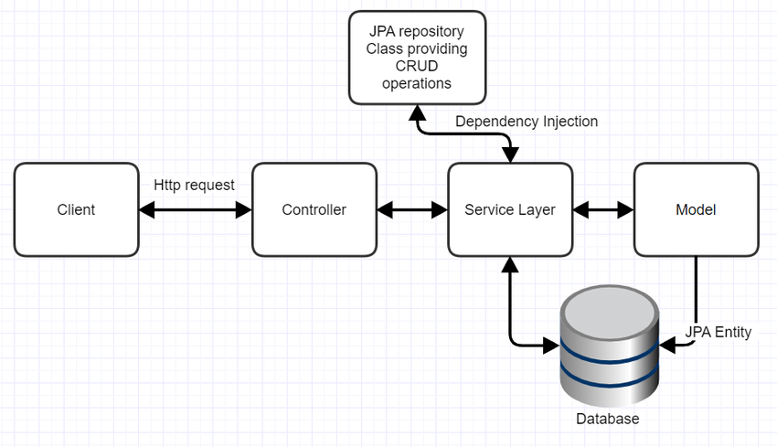

# Rapport technique

## Spring

Pour la mise en place de notre projet, nous avons choisi d'utiliser le framework Spring, et plus précisément Spring Boot. En effet, ce framework est particulièrement adaptée à la mise en place du application web utilisant une API REST. 

Le principe de Spring Boot est de séparer les méthodes entre diverses classes : 
  - Les controleurs qui vont recevoir les requêtes et appeler les fonctions correspondantes.
  - Les services qui vont posséder des méthodes visant à répondre aux demandes des controleurs.
  - Les entités qui représentent toutes les classes qui vont être la base de l'application.
  - Les repositories qui contiennent toutes les instances de chaque entités. Elles communiquent directement avec la base de données grâce à Hibernate.

La principale force de Spring Boot est l'automatisation des liens entre les controleurs, les services et les repositories, permettant de grandement simplifier la mise en place du serveur.

Hibernate s'occupe de générer dans la base MySql les tables dont nous avons besoin, il génère également une table seq pour chacune, permettant de générer automatiquement les IDs des entités qui se trouvent dans la base.

